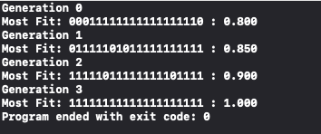

#  Genetic Examples

## Introduction
The following Projects illustrate how to integrate the [Swift Genetics Package](https://github.com/rloniello/Genetics) to solve general-purpose problems. 

### Truth Seekers
#### Command-line tool
- [x] Simple boolean chromosome. 
- [x] Standard Implementation.

This project is concerned with the basics. Simple declaration of the genetic object with boolean traits.
Fitness is calculated by how many traits are true over the total number of traits.
This project also describes how decimal values (Float / Double) can be used as probabilities for truthfulness.

### NthLetterGuess
#### iOS Project
- [x] Update the UI after each Generation.
- [x] Character-based chromosome.
- [x] Variable length chromosome.

This project shows how to implement a character-based chromosome to find a solution matching the user's input.
Fitness is calculated by the Hamming Distance to a target string. 
It is quite common to encode chromosomes into characters that represent features of the organism. 

